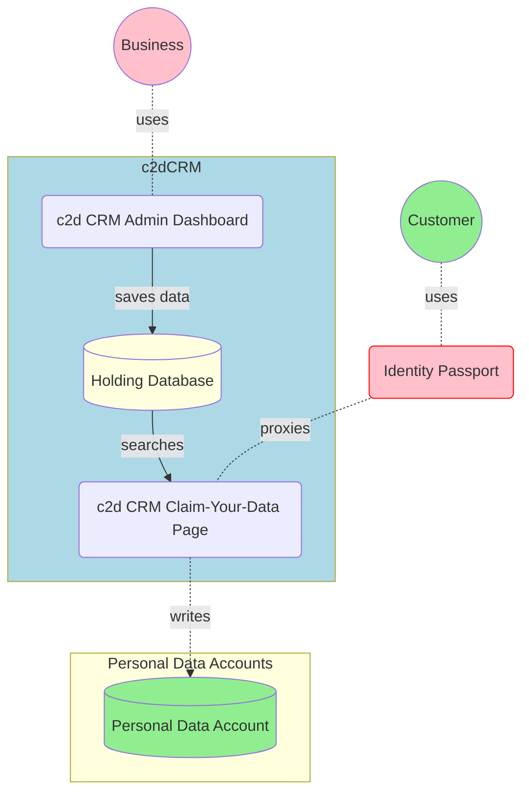

# c2d CRM Component Specifications

## Document Version Control 

| Date | Description | Version | Organisation | Name |
| -------- | -------- | -------- | -------- | -------- |
| 06-04-2021 | Initial Document   | 0.1   | Play Concepts Ltd | Terry Lee |
| 10-04-2021 | Identity Passport Added | 0.2 | Play Concepts Ltd | Terry Lee |

### Document Scope 

The scope of this document only covers the components needed to fulfil the requirements of the immediate project.  

### Table of Contents 

[TOC]

## About the c2d CRM Component

### Etymology

`c2d`is the abbreviation of `Centralised to Decentralised`.

### Overview

Many current businesses have legacy data of their customers in proprietary formats. Some even have them in desktop spreadsheets such as Excel or CSV files.

In the process of modernising their businesses and bringing them to the forefront of the digital economy, a new method of handling their customer data is required. It is now paramount to addressing the increasing privacy concerns of customers and to comply with modern privacy regulations such as the GDPR and CCPA.

One way to deal with such requirements is to return the data to the customer, and transfer maintenance and ownership of the data to the customer himself.

The above is not unique to commercial entities along. Government bodies such as the City of Elyria, are also looking to return citizenry data to its constituents. The aim of this project is to build a tool that allows the City of Elyria to do just that.

### Stakeholders

| Stakeholder           | Location      | Role                                            |
| --------------------- | ------------- | ----------------------------------------------- |
| City of Elyria        | Ohio, US      | Product Owner, Data Supplier                    |
| University of Warwick | Coventry, UK  | Service Designer, CRM Provider                  |
| Dataswift Ltd         | Cambridge, UK | Personal Data Account / Infrastructure Provider |
| OneZero-me Ltd        | London, UK    | Identity Passport Provider                      |

### Purpose

The main purpose of the `c2d` project is to provide an avenue for the business/government entity to transfer its legacy customer data to its individual customers.

### Considerations and Assumptions

When designing this project, several factors are taken into consideration

Although the first beneficiary of this project is the City of Elyria, the output of this `c2d` project should **easily be replicated and customised** for another similar entity.

As such, it is assumed that the potential customer has **existing access control systems** that `c2d`must **integrate** with.

It is also assumed that the **CSV file format** is the lowest common denominator. Whatever legacy data formats employed by the customer, it is possible to export the relevant data out in CSV format.

## Logical Design

### Logical Architecture

### User Journey

1. Using the **Admin Dashboard**, the Business **uploads a CSV** containing customer information that is to be transferred back to the Customer
2. The uploaded data is saved in a holding **database**.
3. The Customer **signs in** to the **Identity Passport** with his PDA. If he does not have one, a PDA will be created for him.
4. The **Identity Passport** brings the Customer to the **Claim-Your-Data** page.
5. The Customer **searches** for himself on the page. If found, a **confirmation prompt** is shown.
6. On clicking **OK** on the confirmation prompt, the data will be written to the Customer's PDA. The corresponding record on the holding database will be **deleted**.
7. The Customer is returned to the Identity Passport.

### Project Scope

1. Web based Admin Dashboard for the Business
2. Web based Claim Your Data page for the Customer
3. supporting Data Service REST APIs
4. Integrate with Identity Passport

## Features

### REST API

There are 4 main API endpoints to handle the following functions

- [ ] 1. to receive an uploaded CSV file containing Customer information and

  - [ ] transform it according to predefined rule-set
    - [ ] the transformation rule-set in defined in a configuration file as part of the deployment package
  - [ ] store the transformed data in a database

- [ ] 2. to allow the Business view the uploaded data (both claimed and unclaimed)

- [ ] 3. to allow the Customer to claim his data

  - [ ] on claiming the data, it would then be deleted from the database
  - [ ] on claiming that data, the data would be written into his PDA
    - [ ] the format of the data that's written into his PDA is the exact format as defined in the transformation rule-set   above
  - [ ] 4. as a dependency, there would also be an API to allow the customer to search for his user data, so as to claim it

### Customer's Claim-Your-Data Page

This is a Web interface that allows the Customer to call the relevant REST API

- [ ] to search for his own entry in the database
- [ ] to claim that entry as his own

### Admin Dashboard

The admin dashboard is used by the Business and comprises of

- [ ] a page to upload a CSV file and send it to the appropriate API endpoint for processing
- [ ] a page to view
  - [ ] data that has been uploaded
  - [ ] data that has been claimed

## Components Design

### Authentication and Security

The c2d CRM will have 3 security modes

**2 modes for the Business**

* its own independent access control credentials
* integrated security module using common JWT secrets. https://jwt.io/

**For the Customer**

* the CRM will be able to recognise PDA JWT tokens. 

### Technical Stack

**Database**

Postgresql 13.x https://www.postgresql.org/

**Middleware**

FastAPI https://fastapi.tiangolo.com/

**Frontend**

React https://reactjs.org/

## Scope of Work

### UI Design

* Admin Dashboard
  * Page to upload CSV
  * Page to view uploaded data
    * Claimed and Unclaimed must be differentiated.
* User Page to claim their data. This page should contain
  * some search fields
  * prompts

### Code

* Development of the Admin Dashboard
* Development of the User Claim-Your-Data page.
* Development of supporting Backend Data Service APIs
* Development of integrated Security Module
* Integration with OZM Identity Passport

### Technical Project Delivery

* Codes should be diligently committed to a provided git repository.
* The delivered project should contain a README file
* This project will be open-sourced with the Mozilla Public License. https://www.mozilla.org/en-US/MPL/2.0/

## Live Operations Cost

The following table lists the costs of running the application when the Data Wallet goes live

| Description               | Service Provider | £ / mth |
| ------------------------- | ---------------- | ------- |
| Platform API Subscription | Dataswift Ltd    | 25      |
|                           |                  |         |

