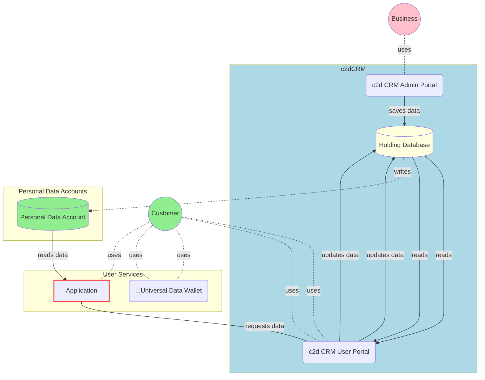

# c2d CRM Platform Design

## Logical Architecture

## Data Flow

### Accessing Customer Data

1. The `Business` prepares a CSV file of its customers from its internal data sources and uploads it into the `c2d CRM Admin Portal`. **Customer data** from the file would be processed and stored on the CRM database.
2. A `Application` who wants to access the customer data of the `Business` will make a **request** to do so via an API call to the c2dCRM
3. The Business' c2dCRM will then **write** the customer data to the `Customer `'s `Personal Data Account` (PDA). (If necessary, a PDA will be created for the customer).
4. The `Application`then **requests permission** from the `Customer` to **read** the customer data from the PDA. When authorised, the customer data is read from the PDA, for the internal use of the application.
5. During the authorisation process, the data requested is presented to the Customer. if the `Customer` needs to update his data, he can do so before completing the authorisation. See _Updating Customer Data_

### Updating Customer Data

The `c2d CRM User Portal` allows the Customer to update his information and have the update information verified by the business.

There are several scenarios where an customer data update can occur.

1. the customer discovers an error in the data during the data request authorisation process
2. the information about the customer has changed and the customer needs to inform the business. (for example, moving house)
3. the Customer can view the data that has been written to his PDA by the Business via his `Universal Data Wallet`. If the data is found to require updating, he is then brought to the `c2d CRM User Portal` to do so.

When a piece of customer data is updated, the Business can choose to verify the data using their internal KYC verification process. The data can then be flagged as verified in the CRM database.